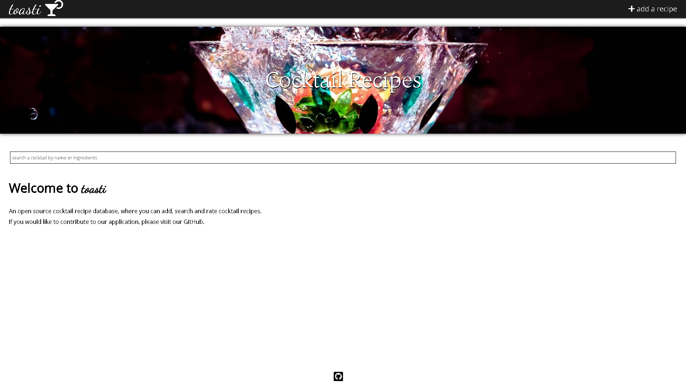

## toasti
An application made for users to add, search, and rate cocktail recipes.

## Screenshots


 ## Tech/framework used
jQuery, MySQL/Sequelize, Node/Express

 ## Installation
If you want to try it out locally, fork the repo, clone your forked repository, and run the following in the root directory:
```sh
npm install && npm start
```

 ## Contribute
If you would like to contribute, please open an issue and submit a pull request so that someone may review it. 

 ## Credits
Zack Miles,
Veronica Blaha,
Gina Yi,
Christian Graves
