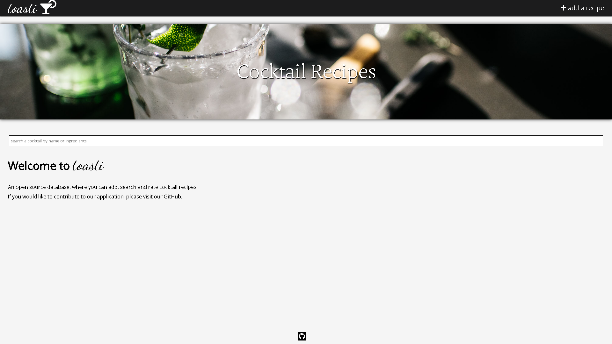

## toasti
An application made for users to add, search, and rate cocktail recipes.

## Screenshots


 ## Tech/framework used
HTML, CSS, JavaScript, jQuery, MySQL, Sequelize.js, Node.js, Express, Mocha, Chai, Sinon

 ## Installation
You will need to run the MySQL server locally, so please install [MAMP](https://www.mamp.info/en/downloads/).
In order to manage the the local database, you will also need [MySQL Workbench](https://dev.mysql.com/downloads/workbench/).
If you want to try it out locally, fork the repo, clone your forked repository, make sure to have MySQL server running via MAMP, and run the following in the root directory:
```sh
npm install && npm start
```

 ## Contribute
If you would like to contribute, please open an issue and submit a pull request so that someone may review it. 

 ## Credits
Zack Miles,
Veronica Blaha,
Gina Yi,
Christian Graves
